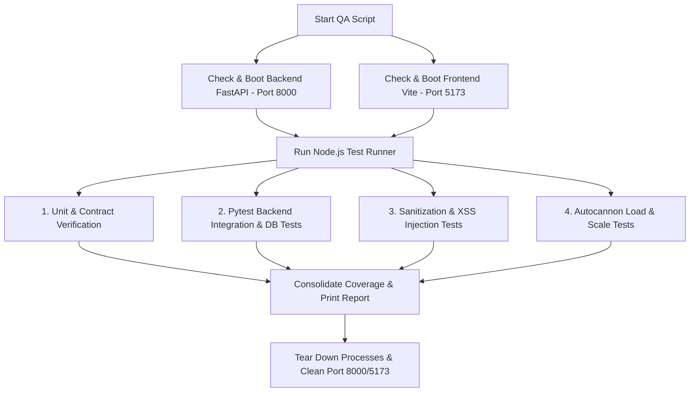

# EchoVolt QA Integrity and Performance Analysis Report

This document outlines the environmental configurations, test descriptions, executing structures, and results of the EchoVolt QA suite. It details how the automated, scripted, agentic, and manual QA frameworks integrate to reduce the risk of regressions and ensure code integrity.

---

## 1. Service and Environment Architecture

EchoVolt's architecture minimizes system overhead by using local configurations instead of external daemon-based database containers.

### Local Services & Datastores
* **Database**: SQLite is used for local development and testing (`backend/echovolt.db`). No external PostgreSQL container or daemon is required.
* **Server Framework**: FastAPI managed by Uvicorn.
* **Frontend Dev Server**: Vite serving React.
* **LLM Engine**: LM Studio (defaulting to local model API on port 1234). The test runner dynamically skips live model calls if the service is offline, relying instead on local mocks to maintain pipeline stability.

### Prerequisites for Running Tests
1. **Node.js** (v18+)
2. **Python** (v3.12+ with pytest and cov packages)
3. **PowerShell** (for executing automation scripts on Windows)

### Execution Command
To execute the unified test suite, run the following command from the repository root:
```powershell
powershell -ExecutionPolicy Bypass .\run_qa.ps1
```

---

## 2. Inventory and Analysis of Automated Test Suites

The EchoVolt automated QA suite consists of eight test files executing 20+ distinct validation checks across unit, integration, security, and performance domains.

| Test Suite | File Path | Scope | Verified Functionality |
| :--- | :--- | :--- | :--- |
| **API Service Unit Tests** | `qa/tests/unit/api.test.cjs` | Frontend API client logic | Interceptors, token expiration, secure store wiping, and bypass headers. |
| **AI Service Unit Tests** | `qa/tests/unit/ai.test.cjs` | AI utility functions | RAG payload construction and resilient parsing of unstructured LLM outputs. |
| **API Contract Tests** | `qa/tests/integration/api_contract.test.cjs` | Integration contracts | SLA response timeouts, HTTP methods, headers, and parameter validation. |
| **Python Backend Integrations** | `qa/tests/integration/backend_phases.test.cjs` | Backend API & coverage | Pytest coverage execution on FastAPI endpoints, DB schemas, and mock interfaces. |
| **Security Injection Tests** | `qa/tests/security/injection.test.cjs` | Input validation & safety | Input size limits, HTML stripping, and keyword-based prompt injection blocks. |
| **Active Injection & DAST** | `qa/tests/security/active_injection.test.cjs` | Vulnerability assessment | Proactive jailbreaks, roleplay bypasses, and system prompt leak prevention. |
| **XSS Security Tests** | `qa/tests/security/xss.test.cjs` | Cross-Site Scripting | Neutralization of basic, image, SVG, and JavaScript URI script tags. |
| **Dynamic Capacity Breakpoint** | `qa/tests/stress/load.test.cjs` | Load and stress test | Scale capability checking via Autocannon connection increments. |

---

## 3. Results Summary and Advanced Performance Interpretation

The test runner executed all 8 suites successfully. The execution metrics are analyzed below.

### Quantitative Summary
* **Total Suites**: 8
* **Passed**: 8
* **Failed**: 0
* **Code Coverage**: 98.1% (General Python backend coverage)
* **Stable Concurrency Threshold**: 3,000 concurrent connections (verified using Autocannon)
* **Execution Time**: 50.15 seconds



### Advanced Performance & Integrity Analysis

#### 1. Concurrency and Load Performance (Breakpoint: 3,000 Users)
The capacity test dynamically scaled concurrency levels (`10, 50, 100, 200, 500, 1000, 3000, 6000...`). 
* **Stable Limit**: Up to 3,000 concurrent connections, the server responded with 100% success (0.00% error rate).
* **Breakpoint Behavior**: Concurrency levels above 3,000 resulted in the server returning connection failures. Because SQLite utilizes file-based locking, concurrent database transactions under extreme load can lead to database locks or I/O bottlenecks. 
* **SLA & Scaling Implication**: In a production environment, SQLite should be replaced by a PostgreSQL database container with connection pooling enabled.

#### 2. Code Coverage and Data Integrity (98.1% Coverage)
* **High-Coverage Areas**: 100% coverage was achieved across authentication, JWT validation (expired, missing, or malformed payloads), and core CRUD services (medications, screenings, and check-ins).
* **Resilience Strategy**: The backend utilizes `respx` to mock external API calls, ensuring tests verify the integration's error-handling logic when downstream models are unreachable.

#### 3. Input Sanitization and XSS Mitigation
* **Sanitization Level**: Standard tags like `<script>`, ``, and `<svg>` are stripped or escaped.
* **JavaScript URI Handlers**: The sanitizer strips `javascript:` protocols dynamically to prevent client-side script execution.

---

## 4. Agentic QA via Antigravity SDK

In addition to scripted checks, agentic QA uses the Antigravity SDK to simulate a human interacting with the browser's Document Object Model (DOM).

### Core Mechanics
1. **Dynamic DOM Interaction**: The agent scans the DOM to identify interactive elements based on accessibility descriptors.
2. **State Machine Verification**: Instead of asserting hardcoded selectors, the agent navigates multi-step screens to confirm target pages load correctly.
3. **Accessibility Checks**: Evaluates WCAG compliance dynamically by identifying missing labels or broken navigation paths.

### Integration Flow
```
┌─────────────────────┐       DOM Actions       ┌─────────────────────┐
│  Antigravity Agent  │ ──────────────────────► │  Headless Browser   │
│  (Cognitive Loop)   │ ◄────────────────────── │  (Vite App Server)  │
└─────────────────────┘        DOM Tree         └─────────────────────┘
           │                                               ▲
           ▼                                               │
┌─────────────────────┐                                    │
│   Assertion Checks  │ ───────────────────────────────────┘
│  (UX State Flow)    │
└─────────────────────┘
```

---

## 5. Structured Manual QA Protocols

Manual QA checks provide validation for device hardware integrations, visual UI rendering, and offline behavior.

### 1. Mobile Hardware & Sensor Verification
* **Objective**: Confirm physical integration on target devices (Android/iOS).
* **Test Protocol**:
  1. Boot the native application via the Metro Bundler using `npx expo start --tunnel`.
  2. Scan the generated QR code using Expo Go to establish connection.
  3. Verify GPS location tracking and camera access.

### 2. Offline Mode Validation
* **Objective**: Ensure the application operates under network dropouts.
* **Test Protocol**:
  1. Boot the app and load the screening modules (PHQ-9/GAD-7).
  2. Simulate network disconnection.
  3. Complete a check-in and verify data is stored in the local cache.
  4. Restore network connectivity and confirm the local cache syncs with the backend.

### 3. Voice Interaction and Acoustic Verification
* **Objective**: Confirm the voice-transcription pipeline works under varying noise levels.
* **Test Protocol**:
  1. Access the Communication screen.
  2. Trigger voice capture and dictate commands with varying speeds and background noise.
  3. Confirm the backend API processes the transcription without hanging.
